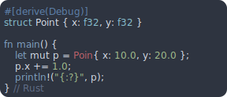
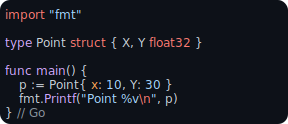
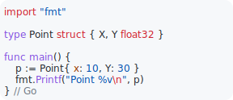
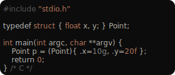

# Schemes

Minimal editor-agnostic color scheme framework.


## Specification

Schemes are small, human readable .svg files that can be shared with code examples
"baked" into the scheme itself. This lets you see real world examples before
installing it, while also making the process of sharing as easy as copying an image.

Each scheme is limited to **8 colors** *(this will not change)*:

```
c0: Background
c1: Foreground, Operators
c2: Types
c3: Procedures, Keywords
c4: Constants, Strings
c5: Pre-Processor, Special (annotations, escape sequences, etc.)
c6: Errors
c7: Comments
```

A scheme file (Nordic):

```xml
<svg width='288px' height='140px' xmlns='http://www.w3.org/2000/svg' baseProfile='full' version='1.1' >
   <title>Nordic by Judah Caruso</title>
   <style>
      #c0 { fill: #2E3440; } <!-- Background -->
      #c1 { fill: #D8DEE9; } <!-- Foreground, Operators --> 
      #c2 { fill: #88C0D0; } <!-- Types --> 
      #c3 { fill: #81A1C1; } <!-- Procedures, Keywords --> 
      #c4 { fill: #A3BE8C; } <!-- Constants, Strings -->
      #c5 { fill: #5E81AC; } <!-- Pre-Processor, Special -->
      #c6 { fill: #BF616A; } <!-- Errors -->
      #c7 { fill: #616E88; } <!-- Comments --> 
   </style>

   <rect width='288' height='140' id='c0'></rect>   
   <text x='10' y='20' style="font-family: monospace" id="c1">
      <tspan x='10'><tspan id='c5'>&#35;include</tspan> <tspan id='c4'>&lt;stdio.h&gt;</tspan></tspan>
      <tspan x='10' dy='2em'><tspan id='c3'>typedef</tspan> <tspan id='c2'>struct</tspan> &#123; <tspan id='c2'>float</tspan> x&#44; y&#59; &#125; Point&#59;</tspan>
      <tspan x='10' dy='2em'><tspan id='c2'>int</tspan> <tspan id='c3'>main</tspan>&#40;<tspan id='c2'>int</tspan> <tspan>argc</tspan>&#44; <tspan id='c2'>char</tspan>&#42; <tspan>argv</tspan>&#91;&#93;&#41;</tspan>
      <tspan x='10' dy='1em'>&#123;</tspan>
      <tspan x='25' dy='1em'><tspan><tspan id='c3'>if</tspan> &#40;<tspan id='c4'>1</tspan>&#41;</tspan> printf&#40;<tspan id='c4'>"Hello&#44; World!<tspan id='c5'>\n</tspan>"</tspan>&#41;&#59;</tspan>
      <tspan x='25' dy='1em'><tspan id='c3'>return</tspan> <tspan id='c4'>0</tspan>&#59; <tspan id='c7'>// This is a comment</tspan>
      </tspan><tspan x='10' dy='1em'>&#125;</tspan>
   </text>
</svg>

```

How it looks:




To edit a theme, simply modify the file by hand or drag and drop it into [the editor](https://judahcaruso.com/schemes).


## Usage/Installation

Scheme files can be easily converted to your editor's color scheme format
with [this tool](https://judahcaruso.com/schemes). Just drag and drop a scheme
and click on your preferred editor.


## Previews







 


## Ecosystem

If you've written something that uses Schemes, add it below and submit a pull request!

### Libraries

- [schemes.jai](https://github.com/judah-caruso/schemes.jai) - Jai library for working with Schemes
- [schemes.go](https://github.com/judah-caruso/schemes.go) - Go library for working with Schemes
- [schemes.lua](https://github.com/judah-caruso/schemes.lua) - Lua53+ library for working with Schemes


## Reasoning

Porting color schemes between editors is often a time consuming and inconsistent
process as each editor has its own system for highlighting code. Because of this,
color scheme creators end up designing their own frameworks to specify which
colors map to which syntax groups within any/all editors. However, even with
frameworks in place, most ports are still rough approximations of the original.

The idea behind Schemes is to provide a simple (limited palette) format that
maps consistently between editors and can be converted automatically.

As syntax groups of programming languages are already consistent (identifiers, keywords, constants, etc.),
color schemes should be as well.


## Inspirations

- [Themes by 100r](https://github.com/hundredrabbits/Themes)
- [Colors for lite](https://github.com/rxi/lite-colors)


## Contributing

If you've created a new scheme, simply add it to the `Previews` section of 
this file (following the same format) and submit a pull request.

As this project is new, ideas are also welcome.
